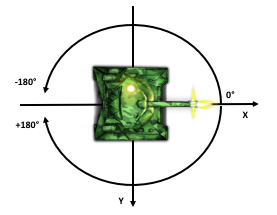

# Algorithms: Geometry Basics

## Radians and Degrees
Each time when dealing with angles, pay attention if the value is provided in Radians or Degrees. Some examples of operations are:

Operation          | Unit
-------------------|----------------
state.angle        | Degrees
state.gun.angle    | Degrees
Math.cos(x)        | Radians
Math.atan2(y, x)   | Radians

The conversion is pretty simple, knowing that 180 degrees is equal to PI

```javascript
radianValue = degreeValue * (Math.PI/180);
```

...or...

```javascript
degreeValue = radianValue * (180/Math.PI);
```

Such operations are used pretty often so Math object in JsBattle was extended by `Math.deg2rad(degreeValue)` and `Math.rad2deg(radianValue)` functions. See [Extended Math Object](../manual/extended_math.md) for more helper functions.


## Normalize angle

Operations on angles can be tricky. Consider the following sum:

```
30° + 200° + 150° = 380°
```

It is over `360°` so we made a full circle plus an additional `20°`. In practice, there is not much difference between `380°` and `20°`. If you rotate the tank by `380°` or by `20°`, it will be heading at exactly the same direction. However, for your code `20` and `380` are definitely not the same numbers since `380 == 20` is `false`.

To make your life easier, all angles in JsBattle are normalized to be in range of -180° to 180° (or between -PI and PI if you are using radians).



If you need to normalize angles during your calculations you can use `Math.rad.normalize(value)` or `Math.deg.normalize(value)` [Extended Math Object](../manual/extended_math.md). For example:

```
  Math.deg.normalize(380) == 20
```

The same logic applies to the calculation of a difference between two angles. Let's assume that you need to calculate the difference between `-170°` and `150°`. Both angles are already normalized but not the result:

```
  -170° - 150° = -320°
```

After normalization, the result is `40°` and this is the actual difference between those two angles.

## Angles in aiming algorithms

### Calculate the angle knowing coordinates

Let's say that you know coordinates of your target `(x2, y2)`, coordinates of your own tank `(x1, y1)` and you need to calculate the angle where your tank should aim to: `angle`.


The easiest way to do it is by arctangents function. [Extended Math Object](../manual/extended_math.md) provides two implementations of that function for both radians and degrees (`Math.rad.atan2(y, x)` and `Math.deg.atan2(y, x)`). Following code will calculate the `angle` in degrees:

```
  angle = Math.deg.atan2(y2 - y1, x2 - x1);
```

For radians calculations you can use both: the native implementation (`Math.atan2(y, x)`) or the [Extended Math Object](../manual/extended_math.md) (`Math.rad.atan2(y, x)`)

### Calculate coordinates knowing the angle

Now let's consider a different situation. You know the position of your tank `(x1, y1)`, and the angle where it is heading (`angle`). You need to find coordinates of the location where the tank will be `(x2, y2)` after travelling a defined `distance` in the current direction.


Such math can be done using sine and cosine functions:

```
x2 = x1 + Math.cos(angle) * distance;
y2 = y1 + Math.sin(angle) * distance;
```

Please keep in mind that the angle must be provided in radians
