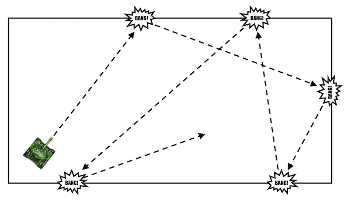

# Algorithms: Movement

## Bouncing off the walls
The simplest algorithm to move across the battlefield and seek for an enemy could be:
1. Move forward until hitting a wall or finding an enemy
2. Stop and exit the algorithm if an enemy found
3. After a collision with a wall, stop and turn any direction
4. Go to point #1



A quite obvious downside of such an approach is that each collision will damage the tank. However, stopping the tank after each wall hit should limit the damage, so it is acceptable when fighting easy enemies.

```javascript
importScripts('lib/tank.js');

// timer of tank turns. Whenever the tank hits a wall, the timer
// will be set to a positive integer. Within each simulation step
// the timer will be decreased by one, eventually hitting zero.
// The tank will keep turning as long as turnTime is above zero.
// In that way, turning will be sustained for several steps of
// the simulation
var turnTime;

tank.init(function(settings, info) {
  // do not turn at the beginning
  turnTime = 0;
});

tank.loop(function(state, control) {
  // scan for an enemy until finding one
  if(!state.radar.enemy) {
  	control.RADAR_TURN = 1;
  } else {
    control.RADAR_TURN = 0;
  }

  if(state.collisions.wall || turnTime > 0 || state.radar.enemy) {
    control.THROTTLE = 0;
  } else {
    control.THROTTLE = 1;
  }

  if(state.collisions.wall) {
    // start turning when hitting a wall
    turnTime = 10;
  }

  // keep turning whenever turn timer is above zero
  // reduce the timer with each step of the simulation
  if(turnTime > 0) {
    control.TURN = 1;
    turnTime--;
  } else {
    control.TURN = 0;
  }
});
```

## Follow the target
To control the distance between your tank and the enemy, you must turn your tank to the direction of the target (step #1). In this way, you can easily be farther or closer by going back and forth (step #2).

```javascript
  // Step #1
  let targetAngle = Math.deg.atan2(state.radar.enemy.y - state.y, state.radar.enemy.x - state.x);
  let bodyAngleDiff = Math.deg.normalize(targetAngle - state.angle);
  control.TURN = 0.5 * bodyAngleDiff;
```

Radar beam has a range of `300` (you can check it in [Constants and Formulas Section](../manual/consts.md) ). Let's assume that a safe distance that avoids losing the target is half of that,  so `150`. The following code will ensure that the tank tries to keep that distance:

```javascript
  // Step #2
  let targetDistance = Math.distance(state.x, state.y, state.radar.enemy.x, state.radar.enemy.y);
  let distanceDiff = targetDistance - 150;
  control.THROTTLE = distanceDiff/100;
```
